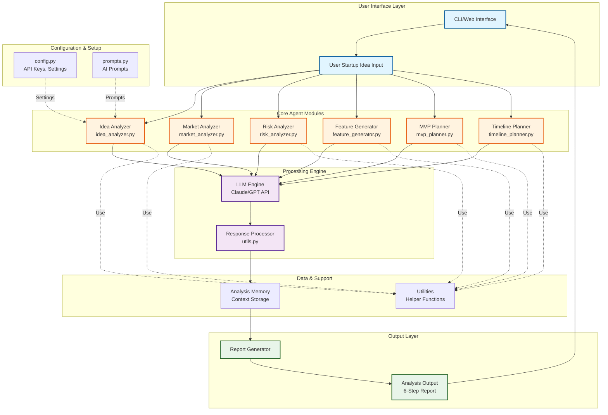
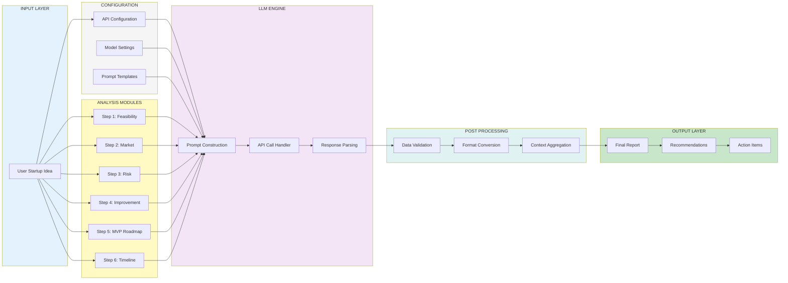
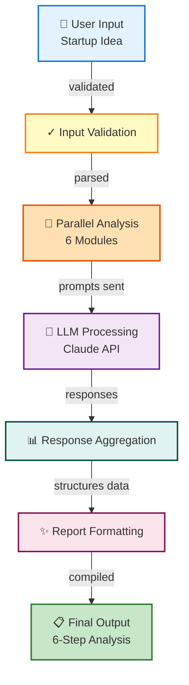

# Startup Validator Agent - System Architecture Diagram

## High-Level Architecture



---

## Detailed Component Architecture



---

## Data Flow Diagram



---

## Technology Stack

| Layer | Technology | Component |
|-------|-----------|-----------|
| **Frontend** | Python CLI | main.py |
| **Config** | Python | config.py |
| **Agents** | Python Classes | agent/*.py |
| **LLM** | Claude/OpenAI API | LLM Engine |
| **Utils** | Python | utils.py |
| **Prompts** | Prompt Templates | prompts/prompts.py |

---

## Dependencies & Interactions

```
main.py
├── config.py (Settings & API keys)
├── utils.py (Helper functions)
├── prompts/prompts.py (Prompt templates)
└── agent/
    ├── idea_analyzer.py (Uses LLM, utils)
    ├── market_analyzer.py (Uses LLM, utils)
    ├── risk_analyzer.py (Uses LLM, utils)
    ├── feature_generator.py (Uses LLM, utils)
    ├── mvp_planner.py (Uses LLM, utils)
    └── timeline_planner.py (Uses LLM, utils)
```

---

## Key Features

✅ **Modular Design** - Each analysis module is independent
✅ **Scalable** - Easy to add new analysis modules
✅ **Configurable** - Centralized configuration management
✅ **Extensible** - Supports multiple LLM providers
✅ **Maintainable** - Clear separation of concerns
