# Startup Validator Agent - System Architecture Diagram

## High-Level Architecture


---

## Detailed Component Architecture


---

## Data Flow Diagram

```mermaid
graph TD
    A["📝 User Input<br/>Startup Idea"] 
    B["✓ Input Validation"]
    C["🔄 Parallel Analysis<br/>6 Modules"]
    D["🤖 LLM Processing<br/>Claude API"]
    E["📊 Response Aggregation"]
    F["✨ Report Formatting"]
    G["📋 Final Output<br/>6-Step Analysis"]
    
    A -->|validated| B
    B -->|parsed| C
    C -->|prompts sent| D
    D -->|responses| E
    E -->|structures data| F
    F -->|compiled| G
    
    style A fill:#e3f2fd,stroke:#1976d2,stroke-width:2px
    style B fill:#fff9c4,stroke:#f57f17,stroke-width:2px
    style C fill:#ffe0b2,stroke:#e65100,stroke-width:2px
    style D fill:#f3e5f5,stroke:#6a1b9a,stroke-width:2px
    style E fill:#e0f2f1,stroke:#004d40,stroke-width:2px
    style F fill:#fce4ec,stroke:#880e4f,stroke-width:2px
    style G fill:#c8e6c9,stroke:#2e7d32,stroke-width:2px
```



---

## Technology Stack

| Layer | Technology | Component |
|-------|-----------|-----------|
| **Frontend** | Python CLI | main.py |
| **Config** | Python | config.py |
| **Agents** | Python Classes | agent/*.py |
| **LLM** | Claude/OpenAI API | LLM Engine |
| **Utils** | Python | utils.py |
| **Prompts** | Prompt Templates | prompts/prompts.py |

---

## Dependencies & Interactions

```
main.py
├── config.py (Settings & API keys)
├── utils.py (Helper functions)
├── prompts/prompts.py (Prompt templates)
└── agent/
    ├── idea_analyzer.py (Uses LLM, utils)
    ├── market_analyzer.py (Uses LLM, utils)
    ├── risk_analyzer.py (Uses LLM, utils)
    ├── feature_generator.py (Uses LLM, utils)
    ├── mvp_planner.py (Uses LLM, utils)
    └── timeline_planner.py (Uses LLM, utils)
```

---

## Key Features

✅ **Modular Design** - Each analysis module is independent
✅ **Scalable** - Easy to add new analysis modules
✅ **Configurable** - Centralized configuration management
✅ **Extensible** - Supports multiple LLM providers
✅ **Maintainable** - Clear separation of concerns
