# Startup Validator Agent - Workflow Diagram

## Complete Workflow

```mermaid
flowchart TD
    START(["🚀 START"]) --> INPUT["📝 User Provides Startup Idea"]
    
    INPUT --> VALIDATE{Idea Valid?}
    VALIDATE -->|No| ERROR["⚠️ Request More Details"]
    ERROR --> INPUT
    VALIDATE -->|Yes| INIT["⚙️ Initialize Analysis Engine"]
    
    INIT --> PHASE1["PHASE 1: Feasibility Analysis<br/>- Technical Complexity<br/>- MVP Timeline<br/>- Budget Estimate<br/>- Team Size<br/>- Dependencies"]
    
    PHASE1 --> PHASE2["PHASE 2: Market Analysis<br/>- Target Users<br/>- Market Size<br/>- Market Demand<br/>- Competition<br/>- Go-to-Market"]
    
    PHASE2 --> PHASE3["PHASE 3: Risk Identification<br/>- Technical Risks<br/>- Market Risks<br/>- Execution Risks<br/>- Financial Risks<br/>- Regulatory Risks"]
    
    PHASE3 --> PHASE4["PHASE 4: Idea Improvements<br/>- Core Hypothesis<br/>- MVP Features<br/>- Out of Scope Items<br/>- Scope Optimization"]
    
    PHASE4 --> PHASE5["PHASE 5: MVP Roadmap<br/>- Phase 1-8 Planning<br/>- Deliverables<br/>- Success Criteria<br/>- Dependencies"]
    
    PHASE5 --> PHASE6["PHASE 6: Execution Timeline<br/>- 12-Week Detailed Plan<br/>- Weekly Milestones<br/>- Owner Assignment<br/>- Critical Path"]
    
    PHASE6 --> COMPILE["📊 Compile All Results"]
    
    COMPILE --> REPORT["📋 Generate Final Report"]
    
    REPORT --> OUTPUT["📤 Output Analysis<br/>6-Step Comprehensive Report"]
    
    OUTPUT --> END(["✅ COMPLETE"])
    
    style START fill:#4caf50,stroke:#2e7d32,color:#fff
    style INPUT fill:#2196f3,stroke:#1565c0,color:#fff
    style VALIDATE fill:#ff9800,stroke:#e65100,color:#fff
    style ERROR fill:#f44336,stroke:#c62828,color:#fff
    style INIT fill:#9c27b0,stroke:#6a1b9a,color:#fff
    style PHASE1 fill:#ffeb3b,stroke:#f57f17
    style PHASE2 fill:#ffeb3b,stroke:#f57f17
    style PHASE3 fill:#ffeb3b,stroke:#f57f17
    style PHASE4 fill:#ffeb3b,stroke:#f57f17
    style PHASE5 fill:#ffeb3b,stroke:#f57f17
    style PHASE6 fill:#ffeb3b,stroke:#f57f17
    style COMPILE fill:#00bcd4,stroke:#006064,color:#fff
    style REPORT fill:#673ab7,stroke:#4a148c,color:#fff
    style OUTPUT fill:#4caf50,stroke:#2e7d32,color:#fff
    style END fill:#4caf50,stroke:#2e7d32,color:#fff
```

---

## Detailed Step-by-Step Workflow

---

## Parallel Processing Flow

```mermaid
flowchart TD
    INPUT["User Idea Input"]
    
    INPUT --> SPLIT["🔀 Split Analysis<br/>into Parallel Tasks"]
    
    SPLIT --> TASK1["Task 1: Feasibility<br/>- LLM Call<br/>- Parse Response"]
    SPLIT --> TASK2["Task 2: Market<br/>- LLM Call<br/>- Parse Response"]
    SPLIT --> TASK3["Task 3: Risk<br/>- LLM Call<br/>- Parse Response"]
    SPLIT --> TASK4["Task 4: Features<br/>- LLM Call<br/>- Parse Response"]
    SPLIT --> TASK5["Task 5: Roadmap<br/>- LLM Call<br/>- Parse Response"]
    SPLIT --> TASK6["Task 6: Timeline<br/>- LLM Call<br/>- Parse Response"]
    
    TASK1 --> MERGE["🔗 Merge Results"]
    TASK2 --> MERGE
    TASK3 --> MERGE
    TASK4 --> MERGE
    TASK5 --> MERGE
    TASK6 --> MERGE
    
    MERGE --> FORMAT["Format Final Report"]
    FORMAT --> DISPLAY["Display to User"]
    
    style INPUT fill:#2196f3,color:#fff
    style SPLIT fill:#ff9800,color:#fff
    style MERGE fill:#9c27b0,color:#fff
    style FORMAT fill:#4caf50,color:#fff
    style DISPLAY fill:#f44336,color:#fff
    style TASK1 fill:#ffeb3b
    style TASK2 fill:#ffeb3b
    style TASK3 fill:#ffeb3b
    style TASK4 fill:#ffeb3b
    style TASK5 fill:#ffeb3b
    style TASK6 fill:#ffeb3b
```

---

## Decision Tree Workflow

---

## API Call Flow

---

## Error Handling Flow

```mermaid
flowchart TD
    INPUT["Input Received"]
    
    INPUT --> TRY1["Try: Validate Input"]
    TRY1 -->|Error| CATCH1["Catch: Invalid Format"]
    CATCH1 --> RETRY1["Ask for Clarification"]
    RETRY1 --> INPUT
    
    TRY1 -->|Success| TRY2["Try: Call LLM API"]
    TRY2 -->|Error| CATCH2["Catch: API Error"]
    CATCH2 --> RETRY2["Retry with Backoff"]
    RETRY2 --> TRY2
    
    TRY2 -->|Success| TRY3["Try: Parse Response"]
    TRY3 -->|Error| CATCH3["Catch: Parse Error"]
    CATCH3 --> RETRY3["Validate Response Format"]
    RETRY3 --> TRY3
    
    TRY3 -->|Success| SUCCESS["✅ Success"]
    
    style INPUT fill:#2196f3,color:#fff
    style TRY1 fill:#4caf50,color:#fff
    style TRY2 fill:#4caf50,color:#fff
    style TRY3 fill:#4caf50,color:#fff
    style CATCH1 fill:#f44336,color:#fff
    style CATCH2 fill:#f44336,color:#fff
    style CATCH3 fill:#f44336,color:#fff
    style SUCCESS fill:#8bc34a,color:#fff
```

---

## Performance Metrics & Monitoring

---

## Summary

The Startup Validator Agent follows a **6-Phase Analysis Workflow**:

1. **Input Processing** - Validate & prepare user idea
2. **Feasibility Analysis** - Technical & resource assessment
3. **Market Analysis** - Market opportunity evaluation
4. **Risk Identification** - Comprehensive risk assessment
5. **Improvements & MVP** - Refined feature definition
6. **Roadmap & Timeline** - Actionable execution plan

All phases are **LLM-powered** using Claude/OpenAI APIs with proper error handling and validation at each step.
